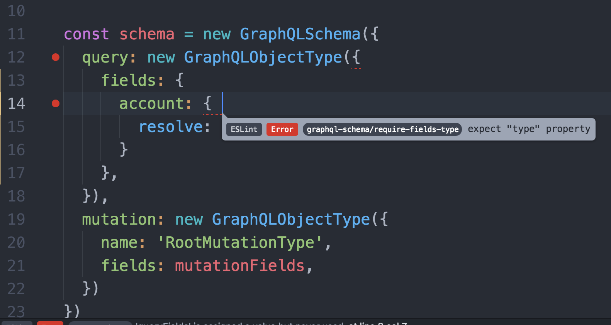

# eslint-plugin-graphql-schema

GraphQL schema specific linting rules for ESLint. Please open issues to help add new rule proposals.



## Installation

```
$ npm i eslint eslint-plugin-graphql-schema  --save-dev
```

## Configuration

Add `plugins` section and specify this plugin:

```json
{
  "plugins": [
    "graphql-schema"
  ]
}
```

## Supported rules

- [graphql-schema/require-args-type](docs/rules/require-args-type.md): All `args` properties need `type` properties
- [graphql-schema/require-fields-type](docs/rules/require-fields-type.md): All `fields` properties(in GraphQLObjectType, GraphQLInterfaceType, GraphQLInputObjectType) need `type` properties
- [graphql-schema/require-constructor-description](docs/rules/require-constructor-description.md): Require `description` property for constructors
- [graphql-schema/require-constructor-props](docs/rules/require-constructor-props.md): Report missing required properties of type constructors

## License

MIT License
